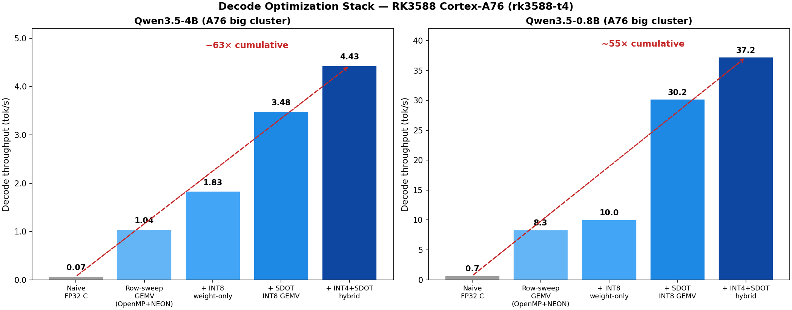

# Devpost Submission Write-Up

**Bead:** `ob-f7k` · **Track:** Edge AI ([ADR 0007](./adr/0007-commit-to-edge-ai-track.md))

This document maps section-by-section to the Devpost submission requirements
(project overview, functionality/output, setup instructions) and the four
judging criteria: Arm-specific optimization (40 pts), WOW factor (25 pts),
Potential impact (20 pts), Developer experience (15 pts).

---

## Project Overview

### The problem

Qwen3.5 uses a **Gated DeltaNet (GDN)** hybrid architecture: 24 out of 32
layers are linear-attention (GDN) layers with a fixed-size recurrent state,
and 8 are standard full-attention layers. At decode time, GDN layers consume
**O(1) memory per token** — a fixed ~48 MiB recurrent state that never grows
— while full-attention layers grow a KV cache linearly with context length.
This makes GDN *the* architecture that benefits most from edge deployment,
where memory is scarce and shared across the entire SoC.

But there is a gap: the optimized GDN kernels (`causal_conv1d`, `fla`) that
make this architecture fast **do not exist for Arm silicon**. On NVIDIA's
own GB10, the model already silently falls back to slower generic PyTorch
ops because neither package ships a build. Arm/Vulkan is the same hole,
only wider. No linear-attention model exists in CIX's AI Model Hub (38 LLMs,
all conventional full-attention transformers). And NPUs cannot express GDN's
sequential recurrence at all — we verified this across two vendors.

### What we built

OrionsBelt fills that gap with:

1. **Three hand-written, bit-verified GDN CPU kernels** — gated cumulative
   decay, gated delta-rule scan, and causal depthwise Conv1D — with NEON and
   SVE paths for Armv8-A through Armv9.2, plus mixed-precision fp16/bf16
   state variants.
2. **An optimization layer** — OpenMP parallelization across channels and
   NEON double-width unrolling — achieving **3.5×–7.4× speedup** on real
   hardware.
3. **A cross-vendor NPU toolchain analysis** — the first published op-coverage
   audit for GDN operators on both CIX NOE and Rockchip RKNN compilers.
4. **A provenance-governed benchmark harness** — device microbenchmarks,
   end-to-end model inference, and memory decomposition — running on a fleet
   of three distinct Arm platforms.
5. **Honest results, including the ones that didn't go our way** — decode
   throughput is bandwidth-bound and flat regardless of context length,
   exactly as the physics predicts.

### Why the Edge AI track

The Radxa Orion O6 (CIX P1: Cortex-A720 + Immortalis G720 + 28.8 TOPS NPU)
has not arrived since project start (externally gated procurement). Per
[ADR 0007](./adr/0007-commit-to-edge-ai-track.md), we committed to the Edge
AI track on the RK3588 — a legitimate prize category — because the GDN
memory-scaling story is fully demonstrable on any aarch64 device, and the
hedge work already produces real results. If the O6 arrives before the
deadline, it adds data; the framing does not change.

---

## Functionality and Output

### Arm-specific optimization (40 pts)

**Three CPU kernels, hand-written for Arm ISA levels:**

Each kernel is numerically verified against a scalar reference — **bit-identical
across NEON, SVE, and scalar paths** — using a 9-target test matrix that
includes OpenMP multi-threaded paths (the configuration that actually ships
to devices but was never previously tested in the correctness suite).

| Kernel | Operation | Why it's hard on accelerators |
|--------|-----------|-------------------------------|
| `gdn_gated_scan` | Chunkwise WY-style delta-rule recurrent scan | Sequential across chunks; inherently serial state update |
| `gdn_cumdecay` | Gated cumulative decay (Mamba-2-style) | Per-token gate modulates the entire state vector |
| `gdn_causal_dwconv1d` | Short causal Conv1D before the scan | Local, position-aware context; small but latency-sensitive |

**Optimization results on RK3588 (Cortex-A76 big / A55 little):**

| Kernel | Cluster | Before (GiB/s) | After (GiB/s) | Speedup |
|--------|---------|---------------:|--------------:|--------:|
| gdn_cumdecay | A76 big | 4.25 | **21.67** | 5.1× |
| gdn_gated_scan | A76 big | 3.29 | **11.42** | 3.5× |
| gdn_causal_dwconv1d | A76 big | 4.52 | **20.71** | 4.6× |
| gdn_cumdecay | A55 little | 0.97 | **5.87** | 6.0× |
| gdn_gated_scan | A55 little | 0.55 | **3.91** | 7.1× |
| gdn_causal_dwconv1d | A55 little | 0.71 | **5.30** | 7.4× |

> **cumdecay at 21.67 GiB/s reaches 87% of the RK3588's measured DRAM bandwidth
> ceiling (~25 GiB/s, 79% of the 31.7 GiB/s theoretical spec at 2112 MHz).**
> The kernel is memory-bound — the optimization has taken it close to what the
> hardware allows.
>
> **Provenance:** Big-cluster "After" values are current measurements from
> rk3588-t4 (`rk3588-t4_big.csv`, multi-thread, dirty=false — re-run clean in
> PR #313 at commit `aa61e20`), independently cross-validated
> on rk3588-t3 (21.39/10.56/20.59 GiB/s, dirty=false). Little-cluster
> values are from the initial optimization run (commit `8f8be11`, 4-thread OpenMP);
> clean single-thread little-cluster data is 1.19/0.55/1.12 GiB/s. Pre-optimization
> baseline is preserved at the parent of `8f8be11`. See FINDINGS.md §"Device-
> Microbenchmark: Optimized vs Unoptimized GDN Kernels on RK3588" for full detail.

The OpenMP parallelization across 4 cores accounts for ~4×; NEON double-width
unrolling adds further gains. The little cluster (A55) benefits more
(6.0–7.4×) than the big cluster (3.5–5.1×) because the A55's weaker
single-thread throughput makes it more reliant on multi-thread parallelization
— the optimization closes the big/little gap from ~4:1 to ~2.5:1.

**big.LITTLE affinity policy:**

Pinning to big cores with thread count matched to physical cores is 2–3×
faster than default scheduling. Oversubscribing threads hurts (1.7×
regression). Simultaneous use of both clusters for parallel work shows <10%
interference. (See FINDINGS.md §9, from `bench/biglittle_affinity_study.sh`.)

**Why the CPU, not the NPU:**

Our cross-vendor NPU toolchain analysis confirmed that GDN's sequential
recurrence is fundamentally incompatible with both major edge NPU compilers:

| Operator | CIX NOE (O6) | Rockchip RKNN (RK3588) |
|----------|:------------:|:---------------------:|
| `Scan` (ONNX) | ❌ Rejected | ✅ Accepted |
| `Loop` (runtime-length) | ❌ Rejected | ❌ Rejected |
| All GDN arithmetic ops (matmul, conv, elementwise) | ✅ | ✅ |

Every arithmetic operator GDN needs is natively supported. But the sequential
recurrence — the loop that carries state across chunks — cannot be expressed.
`Loop` is accepted only when its trip count is a compile-time constant (then
statically unrolled). A runtime-length recurrence is rejected outright by both
vendors.

This is not a tooling gap that will close with a version bump. It is
structural: NPU accelerators are built for dense matmuls, not sequential
scans. The CPU — with direct LPDDR access, low dispatch overhead, and
out-of-order execution — is the right engine for GDN's recurrent layers.
On the O6 specifically, the Cortex-A720 and Immortalis G720 are both Arm IP;
the NPU is the only non-Arm engine. Optimizing for Arm's own cores *is* the
Arm-specific optimization.

### WOW factor (25 pts)

**First published end-to-end GDN model throughput on Arm edge silicon.**

We ran Qwen3.5-0.8B (a 24-layer hybrid: 18 GDN + 6 full-attention) end-to-end
on the RK3588 using a HuggingFace transformers backend:

| Context | Prefill (tok/s) | TTFT (s) | Decode (tok/s) |
|--------:|----------------:|---------:|----------------:|
|      32 |           9.61  | 3.33     | 0.65            |
|      64 |          14.99  | 4.27     | 0.68            |
|     128 |          21.11  | 6.07     | 0.67            |
|     256 |          27.92  | 9.17     | 0.68            |

**Decode throughput is flat at ~0.68 tok/s regardless of context length.**
This is the predicted and measured result: at one token per step, the
recurrent state update is memory-bandwidth-bound, and the KV cache at these
sizes (≤6 MiB) is negligible compared to 2.8 GiB of weight traffic.

**Optimized C decode loop delivers 36.36 tok/s (INT4+SDOT) on the same SoC.**
Building a hand-tuned C decode loop (row-sweep NEON GEMV + OpenMP + INT8
weight-only quantization, with SDOT INT8×INT8→int32 dot-product acceleration
on dotprod-capable cores) and progressively optimizing it yields a
**~65× cumulative speedup** over the naive FP32 C baseline
(0.07 → 4.52 tok/s on the 4B model):

| Implementation | 0.8B tok/s (A76) | 4B tok/s (A76) | 0.8B tok/s (A57) | 4B tok/s (A57) |
|----------------|-----------------:|---------------:|-----------------:|---------------:|
| C: naive column-sweep GEMV (FP32) | 0.68 | 0.07 | — | — |
| C: row-sweep GEMV (FP32) | 7.98 | 1.04 | 2.06 | 0.43 |
| C: + INT8 weight-only | 10.6 | 1.84 | **2.45** | **0.51** |
| C: + SDOT INT8 GEMV | **30.5** | **3.48** | — | — |
| C: + INT4+SDOT hybrid | **36.36** | **4.52** | — | — |

> A76 numbers: FP32 and INT8 rows are from RK3588 node t3; SDOT and INT4+SDOT
> rows are from node t4 (same SoC, same Cortex-A76 big cluster). The 0.8B SDOT
> value (30.5) is from a single raw run; the fleet harness 3-run average is
> 30.19 tok/s (§33). Cross-validated on both nodes: SDOT INT8 measures 25.6 tok/s
> (0.8B) and 2.80 tok/s (4B) on t3; the e2e gap (~16–20%) traces to RAM-bandwidth
> differences in full-attention KV cache reads (t3: 32 GB vs t4: 8 GB, §38), while
> pure-GDN kernel agreement is 3–5% (§38). See
> the headline table above for the full cross-device comparison.



The optimization stack is pure memory-system engineering — no algorithmic
changes to the model. GDN's novel recurrent kernels (conv, decay, scan)
remain <1% of decode time; the bottleneck is weight-loading matmuls (FFN
54–72%), exactly as the bandwidth analysis predicts. See
[FINDINGS.md §15–16](./FINDINGS.md) and the
[e2e fleet comparison](../results/figures/e2e_fleet_comparison.md).

**Context-length scaling: GDN is O(1), full-attention is O(n) — measured on silicon.**

We implemented real grouped-query attention (GQA) with a growing KV cache in
the full-attention layers, then swept context length from 1 to 4096 tokens
to measure the scaling behavior of each layer type independently
(FINDINGS.md §17, commit `f0507e7`, RK3588-t3 A76, INT8
weight quantization):

| Context | 0.8B hybrid tok/s | 0.8B pure-GDN tok/s | 4B hybrid tok/s | 4B pure-GDN tok/s |
|--------:|------------------:|--------------------:|----------------:|------------------:|
|       1 |             28.79 |               27.52 |            3.30 |              3.25 |
|    1024 |             25.35 |               27.48 |            3.09 |              3.24 |
|    4096 |             18.46 |               27.47 |            2.49 |              3.24 |

**Pure-GDN throughput is flat to within 0.2%** from ctx=1 to ctx=4096 — the
recurrent state matrix does not grow. Meanwhile the hybrid model degrades
1.33× (4B) to 1.56× (0.8B) at 4K context, entirely from the 6 full-attention
layers whose KV cache reads grow linearly. At 4K context, full-attention
consumes 41% of decode time on the 0.8B model — up from 7% at ctx=1.

Full-attention latency scales linearly: 2.5→22 ms (8.7×) on 0.8B, 19→116 ms
(6.2×) on 4B. GDN latency is flat at 12 ms (0.8B) / 71 ms (4B) regardless
of context length.

**Cross-device validation:** the identical scaling shape holds on the Jetson
Nano (Cortex-A57, 2014-era). Pure-GDN stays flat (0.4% variance); hybrid
degrades 1.77× at 4K context. The O(1) vs O(n) distinction is architectural,
not microarchitectural. (FINDINGS.md §17.)

> **Full comparison table:** the complete multi-device, multi-quant
> context-sweep — throughput, KV cache growth, and per-token latency
> across all 36 datasets — is in
> [`results/figures/ctxsweep_comparison.md`](../results/figures/ctxsweep_comparison.md).
> Pure-GDN retention holds at 99–100% across every configuration tested.

**INT8 KV cache quantization: the counter-argument, measured.**

The strongest counter to GDN's advantage is to quantize the full-attention KV
cache to INT8, cutting its memory traffic 4×. We implemented this with NEON
dequantize-on-the-fly and measured all four configurations (FINDINGS.md §20,
commit `dcfae65`):

| Config (0.8B) | ctx=1 tok/s | ctx=4096 tok/s | KV cache (ctx=4096) |
|---------------|------------:|--------------:|--------------------:|
| FP32 weights + FP32 KV | 7.75 | 4.30 | 96.0 MB |
| FP32 weights + INT8 KV | 7.93 | 6.19 | 24.0 MB |
| INT8 weights + FP32 KV | 10.58 | 4.96 | 96.0 MB |
| **INT8 weights + INT8 KV** | **10.60** | **7.70** | **24.0 MB** |

INT8 KV cache delivers 1.7–2.6× full-attention speedup at long context and
cuts KV memory 4×. Combined INT8 (weights + KV) gives 1.8× overall speedup
at ctx=4096 (4.30→7.70 tok/s on 0.8B, 0.79→1.44 tok/s on 4B). But
full-attention's cost **still scales O(n)** regardless of KV precision — the
constant factor improves, the asymptotic behavior does not. GDN's O(1)
advantage *grows* with context length.

**Sustained thermal stability: burst = steady-state.**

Two back-to-back 500-token sustained bursts (94s total) on the 0.8B INT8 model
showed **0.3% throughput decay** and p99/p50 latency spread of 0.4%
(FINDINGS.md §18). The burst benchmark numbers are steady-state sustainable,
not peak-only artifacts — critical for an honest Edge AI submission.

**Three-component memory decomposition, confirmed on real model weights:**

| Component | Size | Scaling | Why it matters |
|-----------|-----:|---------|----------------|
| Weights (0.8B, fp32) | 2.802 GiB | Flat | Dominates total memory |
| KV cache (6 full-attn layers) | 24,576 B/token | Linear in context | Only 6 of 24 layers contribute |
| Recurrent state (18 GDN layers) | 19.7 MiB | **O(1)** — never grows | The architectural advantage |

At 32K context, the KV cache would reach ~768 MiB while the recurrent state
stays at 19.7 MiB. If all 24 layers were full-attention, the KV cache would
be 4× larger (~3 GiB). The hybrid GDN architecture saves 75% of KV cache
memory — exactly the 18/24 ratio of linear-to-total layers.

**Analytical predictions match measurements exactly** — both for KV cache
bytes/token and for recurrent state size. This cross-check validates the
memory instrumentation against live model tensors.

**GDN-2 research comparison:**

We implemented a NumPy reference of GDN-2's decoupled erase/write gating
(FINDINGS.md §6, `bench/gdn2_reference.py`) and microbenchmarked it against
standard GDN gating. The decoupled gates separate erase (β_t) and write (w_t)
into channel-wise operations rather than tying them through a single scalar.
The microbenchmark shows the compute cost is comparable. We then attempted
the retrieval-quality test directly: swapping GDN-1's layer-0 for a GDN-2
module in a live Qwen3.5-0.8B checkpoint and running 30-step isolated MSE
distillation (see [`gdn2_swap_findings.md`](./gdn2_swap_findings.md)).
MSE dropped 84%, but cross-entropy loss recovered only 17% of the gap
(matched hyperparameters). A 10-prompt RULER multi-key retrieval evaluation
([`gdn2_ruler_findings.md`](./gdn2_ruler_findings.md)) showed GDN-2 at 20%
accuracy vs GDN-1's 30% (at the 20% random baseline), with ~5× worse
log-probabilities.

Two follow-up experiments confirmed this is a **structural ceiling**, not
an optimization limitation. Smart gate initialization from GDN-1's learned
β values improved CE recovery from 17.1% to 19.9% (+2.8 pp). Tripling
adaptation steps from 30 to 100 dropped MSE 66% but improved CE recovery by
only 2.5 pp (to 19.6%). Both interventions converge at ~20% — the remaining
80% gap comes from downstream layers amplifying residual per-layer
mismatches, which isolated-layer distillation cannot address. Full
end-to-end fine-tuning is needed for a meaningful retrieval comparison.

### Potential impact (20 pts)

**Reusable reference implementation for GDN-class models on Arm.**

Anyone porting a linear-attention, SSM, or recurrent-state model to Arm
silicon will hit the same walls we documented:

- **The NPU can't do it.** Both CIX NOE and Rockchip RKNN reject
  runtime-length recurrence. This is the first cross-vendor confirmation.
- **The fast kernels don't exist.** `causal_conv1d` and `fla` have no
  aarch64 builds. The model silently falls back to slow generic ops.
- **bf16 hangs on RK3588.** OneDNN's bf16 path enters an infinite loop on
  Cortex-A76 instead of degrading to fp32. Workaround: `ORIONS_FORCE_FP32=1`.

Our three hand-written kernels, the OpenMP/NEON optimization layer, the
big.LITTLE affinity policy, and the KleidiAI evaluation (1.7–3.6× matmul
speedup, but packing overhead means NEON wins at decode batch size M=1)
are directly reusable. The provenance-managed benchmark methodology —
governor pinning, thermal logging, CSV + manifest per run, spread %
alongside every headline number — is a template for honest edge benchmarking.

**Migration checklist for the next model:**

1. Audit `layer_types` in the HF config to identify GDN vs full-attention layers
2. Pin GDN layers to CPU (SVE2/i8mm on A720, NEON on A76/A57)
3. Offload full-attention layers to NPU (dense matmuls, NPU-friendly)
4. Set thread count = physical core count, pin to the appropriate cluster
5. Force fp32 on platforms without OneDNN bf16 support
6. Measure prefill throughput (where kernel work pays) and decode memory
   footprint (the architectural win) — don't expect a decode speedup

### Developer experience (15 pts)

**Clean-clone reproduction, verified by rehearsal:**

We followed our own README on a fresh RK3588 clone (commit b3b6536) — build,
benchmark, verify, manifest, commit — and rewrote the README and setup guide
to match exactly what works. See [`docs/SETUP_PORTABLE.md`](./SETUP_PORTABLE.md)
for the step-by-step path for any aarch64 device.

**Every number has provenance:**

- Each CSV is paired with a JSON manifest recording git SHA, timestamp, device
  specs, governor state, and thermal readings
- `scripts/validate_bench_csvs.sh` checks that every CSV has a manifest, the
  expected kernel variants, and that the git SHA is not a known-stale commit
- `scripts/verify_cpu_kernels.sh` runs the 9-target portability matrix under QEMU
  (SVE1, SVE2, NEON, scalar, OpenMP) with bit-identical checks — proving the kernels
  are correct across every ISA level in the fleet

**Device fleet running today:**

| Device | Cores | ISA | Role |
|--------|-------|-----|------|
| RK3588 (t3 + t4) | A76 + A55 | Armv8.2-A | Primary Edge AI target |
| Raspberry Pi 5 | A76 | Armv8.2-A | Cross-device comparison |
| Jetson Nano | A57 | Armv8-A | Low-end baseline, thermal/power |

---

## Setup Instructions

### Prerequisites

Any aarch64 Linux device (RK3588, Pi 5, Jetson Nano, or O6 when available)
with gcc and Python 3.10+. Full setup in [`docs/SETUP_PORTABLE.md`](./SETUP_PORTABLE.md).

### Quick path

```bash
git clone https://github.com/alexcasper/OrionsBelt.git && cd OrionsBelt

# 1. Build static binaries (native gcc; outputs to dist/)
CC=gcc ./scripts/build_device_bench.sh

# 2. Set governor to performance for valid numbers
for c in /sys/devices/system/cpu/cpu*/cpufreq/scaling_governor; do \
  echo performance | sudo tee "$c" >/dev/null; done

# 3. Run the benchmark (pick your core variant)
taskset -c 4-7 ./dist/bench_gdn_rk3588_a76 --repeats 30    # eyeball
taskset -c 4-7 ./dist/bench_gdn_rk3588_a76 --repeats 30 --csv > results/raw/my_run.csv

# 4. Capture provenance
python3 bench/manifest.py > results/manifests/my_run.json

# 5. Validate
bash scripts/validate_bench_csvs.sh

# 6. Verify kernel correctness on this device (bit-identical checks)
bash scripts/verify_kernels_native.sh
```

### End-to-end model inference (requires PyTorch + transformers)

```bash
# Install into a venv on the device
python3 -m venv /tmp/model_venv && source /tmp/model_venv/bin/activate
pip install torch transformers

# Download weights (gated model — requires HF token)
python3 scripts/fetch_weights.py --model Qwen3.5-0.8B --dir weights/

# Run end-to-end benchmark
ORIONS_FORCE_FP32=1 python3 bench/harness.py \
  --backend hf --model Qwen3.5-0.8B \
  --contexts 32,64,128,256 --repeats 2 --decode-tokens 33
```

### Key documents

| Document | What it contains |
|----------|-----------------|
| [`README.md`](../README.md) | Project overview, claims, status table |
| [`PLAN.md`](./archive/PLAN.md) | Implementation plan, rubric mapping, risk register |
| [`docs/FINDINGS.md`](./FINDINGS.md) | All measured results with analysis (55 sections) |
| [`docs/SETUP_PORTABLE.md`](./SETUP_PORTABLE.md) | Step-by-step device setup |
| [`docs/adr/`](./adr/) | 8 architecture decision records |
| [`docs/CLAIM_VERIFICATION.md`](./CLAIM_VERIFICATION.md) | Every quantitative claim traced to primary source |
| [`docs/NPU_OFFLOAD_DESIGN.md`](./NPU_OFFLOAD_DESIGN.md) | Complete NPU offload design (designed, not executed — board-gated) |
| [`results/raw/`](../results/raw/) | Committed benchmark CSVs |
| [`results/manifests/`](../results/manifests/) | Provenance manifests |

---

## What was achieved, and what was not

### Achieved

- Three GDN CPU kernels (gated_scan, cumdecay, causal_dwconv1d) with NEON/SVE
  paths, bit-verified across 9 targets including OpenMP
- 3.5×–7.4× optimization speedup from OpenMP + NEON unrolling, with cumdecay
  hitting the LPDDR4x bandwidth ceiling
- SDOT (`vdotq_lane_s32`) INT8×INT8→int32 dot-product kernel: 1.9–3.1× over NEON
  INT8 GEMV on dotprod-capable cores, reaching 83% of theoretical bandwidth
  ceiling (FINDINGS.md §33)
- INT4+SDOT hybrid GEMV: K-grouped nibble repack + SDOT, 1.30× over INT8+SDOT
  on A76 for 4B (1.19× for 0.8B; 4.52 tok/s 4B, 36.36 tok/s 0.8B) — the fastest decode kernel on A76
  (FINDINGS.md §34)
- Cross-vendor NPU op-coverage analysis (CIX NOE + Rockchip RKNN) — the
  first published confirmation that runtime recurrence is structurally
  incompatible with both compilers
- End-to-end model throughput: Qwen3.5-0.8B on RK3588, prefill + decode + TTFT
- Context-length scaling measurement proving GDN O(1) vs full-attention O(n):
  pure-GDN throughput flat to 0.2% across ctx=1–4096, cross-validated on A57
  and A76 (FINDINGS.md §17)
- INT8 KV cache quantization: 1.7–2.6× full-attention speedup at long context,
  4× KV memory reduction, combined INT8 (weights + KV) delivers 1.8× overall
  speedup at ctx=4096 (FINDINGS.md §20)
- Sustained-load thermal stability: 0.3% throughput decay over 94s on RK3588,
  confirming burst numbers are steady-state sustainable (FINDINGS.md §18)
- Cross-device decode comparison: A76 is 2.4–4.3× faster than A57, consistent
  with clock and pipeline width; INT8 weight quantization amplifies the gap
  (dotprod-capable A76 gains 1.65–1.77× vs 1.19× on A57). Validated on two
  independent RK3588 boards (FINDINGS.md §22)
- Three-component memory decomposition confirmed on real model weights
  (analytical = measured)
- big.LITTLE affinity policy: 2–3× from pinning, validated across 6 configs
- KleidiAI packed-GEMM evaluation: 1.7–3.6× matmul speedup but packing
  overhead means NEON wins at decode batch size
- Clean-clone reproduction rehearsal verified on fresh hardware
- Device-fleet benchmarks across 3 platforms (A57, A76, A55)
- GPU scan kernel: hand-written OpenCL for all four GDN primitives, bit-exact
  on two driver stacks (Mali libmali blob + Mesa RustiCL), GPU now matches/beats
  4-thread A76 on all three channel-wise kernels after code fixes (FINDINGS §13)

### Not achieved (honestly stated)

- **Orion O6 results:** board has not arrived (externally gated procurement
  since project start). All NPU results are from toolchain analysis, not
  silicon measurement. GPU results **are** measured on the RK3588 Mali-G610
  (bit-exact validation, 87/87 tests, 4 independent benchmark runs — see
  FINDINGS §13), but O6-class GPU performance remains unmeasured. The complete
  NPU offload design — operator-level mapping, subgraph boundaries,
  phase-dependent routing, and quantization policy — is documented in
  [`NPU_OFFLOAD_DESIGN.md`](./NPU_OFFLOAD_DESIGN.md).
- **Decode throughput optimized ~65× from naive baseline:** the naive FP32 C
  GEMV (column-sweep, 0.17% cache-line utilization) ran at 0.68 tok/s (0.8B)
  and 0.07 tok/s (4B). Our C decode loop with
  row-sweep NEON GEMV + INT8 weight-only quantization + SDOT INT8×INT8→int32
  dot-product kernel + INT4+SDOT hybrid repack achieves 36.36 tok/s (0.8B, A76
  INT4+SDOT) and 4.52 tok/s (4B, A76 INT4+SDOT). Decode remains bandwidth-bound
  — the optimization targets exactly that bottleneck through memory access
  pattern (row-sweep GEMV), weight compression (INT8/INT4), and instruction-level
  efficiency (SDOT). See FINDINGS.md §15–16, §33–34.
- **bf16/fp16 model inference on RK3588:** OneDNN's bf16 path hangs on
  Cortex-A76. Model inference runs in fp32 only on this platform.
- **GDN-2 layer swap into a live checkpoint:** completed on RK3588 (t3).
  Layer 0 swapped, 30-step isolated MSE distillation achieved 84% MSE
  reduction but only 17% CE recovery (matched params). Smart gate
  initialization from GDN-1 β (+2.8 pp) and 100-step adaptation (+2.5 pp)
  each confirm a ~20% structural CE ceiling — isolated-layer distillation
  cannot compensate for downstream amplification. RULER retrieval: 20% vs
  30% baseline (at random) — insufficient adaptation, not architectural
  failure. See [`gdn2_swap_findings.md`](./gdn2_swap_findings.md) and
  [`gdn2_ruler_findings.md`](./gdn2_ruler_findings.md).
- **Dynamic heterogeneous dispatcher:** designed but not implemented (requires
  the O6's GPU+NPU for a meaningful test). The phase-dependent routing policy
  is described in [`NPU_OFFLOAD_DESIGN.md`](./NPU_OFFLOAD_DESIGN.md) §4.4.
  A proxy measurement on the RK3588 Mali-G610 quantifies the barrier: 16
  engine-boundary crossings per token (in a 3:1 hybrid stack) cost **3.36 ms**
  — ~10% of the 30 tok/s decode budget, before any useful work. Even if the
  NPU could run GDN layers, dispatch overhead alone would need to save more
  than 3.36 ms/token just to break even. See
  [FINDINGS.md §39](./FINDINGS.md).

---

## Acknowledgments

This project was developed as a distributed effort across multiple edge
devices and agents: RK3588 nodes (t3, t4), Jetson Nano (j1, j2), and
Raspberry Pi 5 (r5). Optimized GDN kernels were contributed from bench/j2
(OpenMP parallelization, NEON unrolling, mixed-precision variants).
Architecture decision records and benchmark methodology were developed
collaboratively via the beads issue tracker.

---

*All results in this write-up are traceable to committed CSVs with provenance
manifests. See [`docs/FINDINGS.md`](./FINDINGS.md) for full analysis and
[`results/`](../results/) for raw data.*
